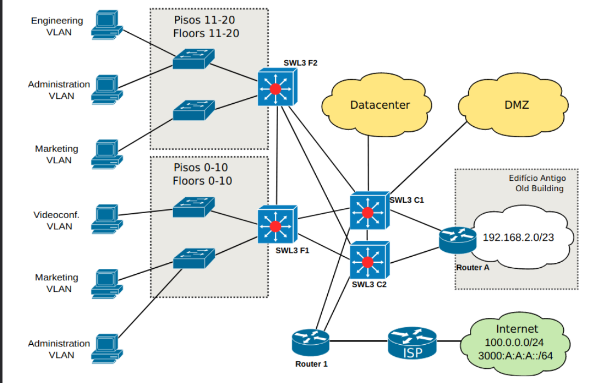

# Simulation of a small business network

## Scheme of the network:   

   

## How to preview it:

Just open the .gns3 file and start the project, everything is working as intended.

## Specifications:

The network IPv4 and IPv6 addresses are in the pdf file.